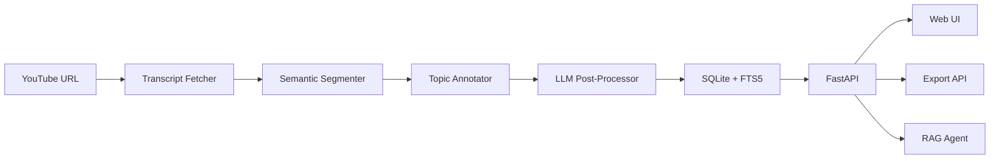

<p align="center">
  
</p>

<h1 align="center">LectureFlow</h1>

<p align="center">
  Makes educational YouTube videos easier to absorb and remember — by turning them into structured notes, flashcards, and quizzes with AI-powered semantic analysis.
</p>

<p align="center">
  
  
  
  
  
</p>

<!-- TODO: Add demo GIF or screenshot of the web UI -->

## Why LectureFlow

Taking notes from video lectures is slow. Existing transcript tools dump raw text without structure. LectureFlow segments transcripts by meaning — not by fixed time windows — then uses LLMs to turn raw chunks into study-ready materials: detailed notes, flashcards, quizzes, or exam prep.

- **Semantic segmentation** — sentence embeddings group related content into coherent topics
- **5 LLM providers** — OpenAI, Anthropic, Groq, Grok, and local Ollama, hot-switchable without code changes
- **6 output modes** — `detailed`, `brief`, `exam`, `flashcards`, `quiz`, `youtube_seo`
- **Search & Q&A** — FTS5 full-text search + RAG agent across your entire video library
- **Self-hosted** — FastAPI backend, web UI, Docker-ready, no GPU required

## Features

### Core Analysis

- Fetch transcripts from YouTube videos and playlists (with Whisper audio fallback)
- Semantic segmentation via sentence-transformer embeddings (all-MiniLM-L6-v2)
- Topic annotation using KeyBERT keyword extraction

### LLM Integration

- LLM post-processing in 6 modes: `detailed`, `brief`, `exam`, `flashcards`, `quiz`, `youtube_seo`
- Multi-provider support with hot-switching via API or UI (OpenAI, Anthropic, Groq, Grok, Ollama)
- Streaming analysis progress via NDJSON

### Search & RAG

- Video library with SQLite persistence and FTS5 full-text search
- RAG-based Q&A agent over the video library
- Semantic video recommendations (cosine similarity) and YouTube search suggestions

### Export & UI

- Export to JSON, Markdown, SRT, and YouTube description formats
- Web UI with provider/model selection, library browser, and real-time progress

### Deployment

- Docker Compose with optional local Ollama for fully offline inference
- Single-command startup, persistent data volumes

## Architecture



| Component | Module | Responsibility |
|-----------|--------|----------------|
| Transcript | `src/core/transcript.py` | Fetches YouTube transcripts, Whisper fallback |
| Segmenter | `src/core/segmenter.py` | Groups chunks by semantic similarity |
| Annotator | `src/core/annotator.py` | Extracts topic labels via KeyBERT |
| Post-processor | `src/core/postprocessor.py` | Enhances segments through LLM |
| Pipeline | `src/core/pipeline.py` | Orchestrates the full analysis flow |
| LLM Factory | `src/llm/factory.py` | Creates provider-specific clients |
| Database | `src/db/` | SQLite persistence with FTS5 search |
| API | `src/api/app.py` | REST endpoints + streaming |
| Export | `src/export/formatters.py` | JSON, Markdown, SRT, YouTube formats |

## Tech Stack

- **Language:** Python 3.11+
- **API:** FastAPI + Uvicorn
- **ML/NLP:** Sentence-Transformers, KeyBERT, PyTorch, NLTK
- **LLM Providers:** OpenAI, Anthropic, Groq, Grok, Ollama
- **Audio:** yt-dlp, OpenAI Whisper
- **Database:** SQLite with FTS5
- **Frontend:** Vanilla JavaScript
- **Deployment:** Docker + Docker Compose

## Quick Start

### Prerequisites

- **Python 3.11+**
- **GPU not required** — all embeddings and NLP run on CPU (sentence-transformers, KeyBERT)
- **At least one LLM API key** — or a local [Ollama](https://ollama.com) installation for fully offline use

| API Key | Env Variable | Required |
|---------|-------------|----------|
| OpenAI | `OPENAI_API_KEY` | No* |
| Anthropic | `ANTHROPIC_API_KEY` | No* |
| Groq | `GROQ_API_KEY` | No* |
| Grok (xAI) | `XAI_API_KEY` | No* |
| Ollama | — | No* |

*At least one provider is required. Ollama needs no API key but must be running locally.

### Local Setup

```bash
git clone https://github.com/KazKozDev/lectureflow.git
cd lectureflow

python -m venv venv
source venv/bin/activate
pip install -r requirements.txt

cp .env.example .env
# Edit .env — add your API key(s) and set LLM_PROVIDER

uvicorn src.api.app:app --host 0.0.0.0 --port 8000
```

Open `http://localhost:8000` in your browser.

### Docker

```bash
cp .env.example .env
# Edit .env with your API keys
docker compose up

# With local Ollama (fully offline):
docker compose --profile local up
```

## Usage

**Analyze a video:**

```bash
curl -X POST http://localhost:8000/api/analyze \
  -H "Content-Type: application/json" \
  -d '{"url": "https://youtube.com/watch?v=VIDEO_ID", "mode": "detailed"}'
```

**Available modes:** `detailed`, `brief`, `exam`, `flashcards`, `quiz`, `youtube_seo`

**Search your library:**

```bash
curl -X POST http://localhost:8000/api/search \
  -H "Content-Type: application/json" \
  -d '{"query": "machine learning"}'
```

**Ask the Q&A agent:**

```bash
curl -X POST http://localhost:8000/api/chat \
  -H "Content-Type: application/json" \
  -d '{"query": "What topics were covered in the last video?"}'
```

## Project Structure

```
src/
  api/            # FastAPI application and endpoints
  core/           # Analysis pipeline (segmenter, annotator, post-processor, agent)
  llm/            # LLM provider clients (OpenAI, Anthropic, Groq, Grok, Ollama)
  db/             # SQLite models and repository
  export/         # Output formatters (JSON, Markdown, SRT, YouTube)
  handlers/       # Error handling
  utils/          # Logging, caching, rate limiting
config/           # YAML configs for models, prompts, logging
public/           # Web UI (HTML, JS, CSS)
tests/            # Pytest test suite
```

## Testing

```bash
# Run full test suite
pytest

# With coverage report
pytest --cov=src --cov-report=term-missing

# Run a specific test file
pytest tests/test_pipeline.py -v
```

Test suite covers: pipeline, database, formatters, LLM clients, caching, rate limiter, error handling, and transcript fetching.

## Known Limitations

- Transcript quality depends on YouTube's auto-generated captions; videos without captions fall back to Whisper (slower, requires `yt-dlp` + `ffmpeg`)
- Semantic segmentation uses CPU-only embeddings — first run downloads the model (~90 MB)
- Ollama provider requires a separately running Ollama instance
- No user authentication — the API is designed for local/personal use
- Batch playlist processing is sequential, not parallel

## Contributing

Contributions are welcome. Fork the repo, create a feature branch, and open a PR.

- **Code style:** [Black](https://github.com/psf/black) (line-length 88) + [Ruff](https://github.com/astral-sh/ruff) for linting
- **Commits:** use conventional format — `feat:`, `fix:`, `refactor:`, `docs:`, `test:`
- **Tests:** run `pytest` before submitting

See [CONTRIBUTING.md](CONTRIBUTING.md) for full guidelines.

## Status

**Stage:** Beta

<!-- TODO: Add roadmap items -->

---

MIT — see [LICENSE](LICENSE)

Artem KK — [kazkozdev@gmail.com](mailto:kazkozdev@gmail.com)
