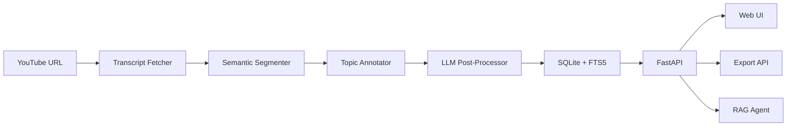

# LectureFlow

Transform YouTube videos into structured notes, flashcards, and quizzes using AI-powered semantic analysis.


## Highlights

- **Semantic segmentation** — groups transcript chunks by meaning using sentence embeddings, not fixed time windows
- **5 LLM providers** — switch between OpenAI, Anthropic Claude, Groq, Grok, and local Ollama without code changes
- **6 output modes** — detailed notes, briefs, exam prep, flashcards, quizzes, and YouTube SEO descriptions
- **Full-text search** — SQLite FTS5 index across all analyzed videos for instant retrieval
- **RAG-powered Q&A** — ask questions about your video library and get sourced answers

## Demo


<!-- TODO: Add demo GIF or screenshot of the web UI -->

## Table of Contents

- [Overview](#overview)
- [Motivation](#motivation)
- [Features](#features)
- [Architecture](#architecture)
- [Tech Stack](#tech-stack)
- [Quick Start](#quick-start)
- [Usage](#usage)
- [Project Structure](#project-structure)
- [Status](#status)
- [Testing](#testing)
- [Contributing](#contributing)

## Overview

LectureFlow fetches YouTube transcripts, segments them semantically using sentence embeddings, annotates topics with keyword extraction, and enhances the output through LLM post-processing. Results are stored in a searchable SQLite database and served through a FastAPI backend with a web UI. Built for students, researchers, and anyone who learns from video content.

## Motivation

Taking notes from video lectures is slow and produces incomplete results. Existing transcript tools dump raw text without structure. LectureFlow applies NLP segmentation to find natural topic boundaries, then uses LLMs to transform raw transcript chunks into polished, study-ready materials in the format you need — whether that's detailed notes, flashcards for spaced repetition, or quiz questions for self-testing.

## Features

- Fetch transcripts from YouTube videos and playlists (with Whisper audio fallback)
- Semantic segmentation via sentence-transformer embeddings (all-MiniLM-L6-v2)
- Topic annotation using KeyBERT keyword extraction
- LLM post-processing in 6 modes: `detailed`, `brief`, `exam`, `flashcards`, `quiz`, `youtube_seo`
- Multi-provider LLM support with hot-switching via API or UI
- Streaming analysis progress via NDJSON
- Video library with SQLite persistence and FTS5 full-text search
- RAG-based Q&A agent over the video library
- Semantic video recommendations (cosine similarity) and YouTube search recommendations
- Export to JSON, Markdown, SRT, and YouTube description formats
- Web UI with provider/model selection, library browser, and real-time progress
- Docker deployment with optional local Ollama

## Architecture



| Component | Module | Responsibility |
|-----------|--------|----------------|
| Transcript | `src/core/transcript.py` | Fetches YouTube transcripts, Whisper fallback |
| Segmenter | `src/core/segmenter.py` | Groups chunks by semantic similarity |
| Annotator | `src/core/annotator.py` | Extracts topic labels via KeyBERT |
| Post-processor | `src/core/postprocessor.py` | Enhances segments through LLM |
| Pipeline | `src/core/pipeline.py` | Orchestrates the full analysis flow |
| LLM Factory | `src/llm/factory.py` | Creates provider-specific clients |
| Database | `src/db/` | SQLite persistence with FTS5 search |
| API | `src/api/app.py` | REST endpoints + streaming |
| Export | `src/export/formatters.py` | JSON, Markdown, SRT, YouTube formats |

## Tech Stack

- **Language:** Python 3.11+
- **API:** FastAPI + Uvicorn
- **ML/NLP:** Sentence-Transformers, KeyBERT, PyTorch, NLTK
- **LLM Providers:** OpenAI, Anthropic, Groq, Grok, Ollama
- **Audio:** yt-dlp, OpenAI Whisper
- **Database:** SQLite with FTS5
- **Frontend:** Vanilla JavaScript
- **Deployment:** Docker + Docker Compose

## Quick Start

```bash
# Clone
git clone https://github.com/KazKozDev/lectureflow.git
cd lectureflow

# Install dependencies
python -m venv venv
source venv/bin/activate
pip install -r requirements.txt

# Configure API keys
cp .env.example .env
# Edit .env with your API keys

# Run
uvicorn src.api.app:app --host 0.0.0.0 --port 8000
```

Open `http://localhost:8000` in your browser.

**Docker alternative:**

```bash
cp .env.example .env
# Edit .env with your API keys
docker compose up

# With local Ollama:
docker compose --profile local up
```

## Usage

**Analyze a video via API:**

```bash
curl -X POST http://localhost:8000/api/analyze \
  -H "Content-Type: application/json" \
  -d '{"url": "https://youtube.com/watch?v=VIDEO_ID", "mode": "detailed"}'
```

**Available modes:** `detailed`, `brief`, `exam`, `flashcards`, `quiz`, `youtube_seo`

**Search your library:**

```bash
curl -X POST http://localhost:8000/api/search \
  -H "Content-Type: application/json" \
  -d '{"query": "machine learning"}'
```

**Ask the Q&A agent:**

```bash
curl -X POST http://localhost:8000/api/chat \
  -H "Content-Type: application/json" \
  -d '{"query": "What topics were covered in the last video?"}'
```

## Project Structure

```
src/
  api/            # FastAPI application and endpoints
  core/           # Analysis pipeline (segmenter, annotator, post-processor, agent)
  llm/            # LLM provider clients (OpenAI, Anthropic, Groq, Grok, Ollama)
  db/             # SQLite models and repository
  export/         # Output formatters (JSON, Markdown, SRT, YouTube)
  handlers/       # Error handling
  utils/          # Logging, caching, rate limiting
config/           # YAML configs for models, prompts, logging
public/           # Web UI (HTML, JS, CSS)
tests/            # Pytest test suite
```

## Status

**Stage:** Beta

<!-- TODO: Add roadmap items -->

## Testing

```bash
pytest
```

## Contributing

See [CONTRIBUTING.md](CONTRIBUTING.md) for guidelines.

---

MIT — see [LICENSE](LICENSE)

Artem KK — [kazkozdev@gmail.com](mailto:kazkozdev@gmail.com)
